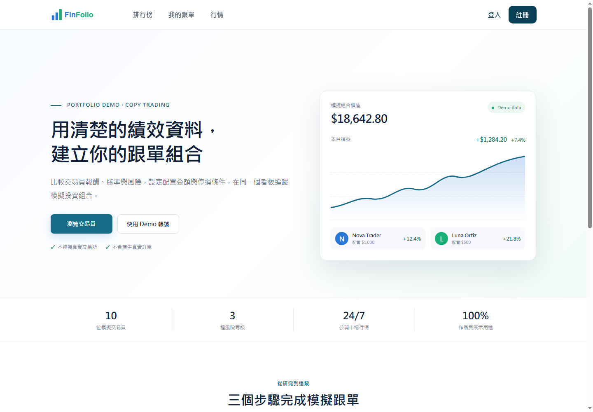
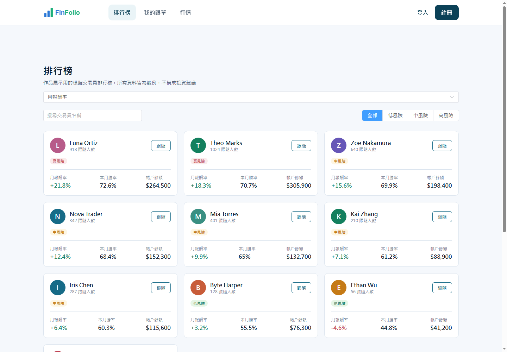
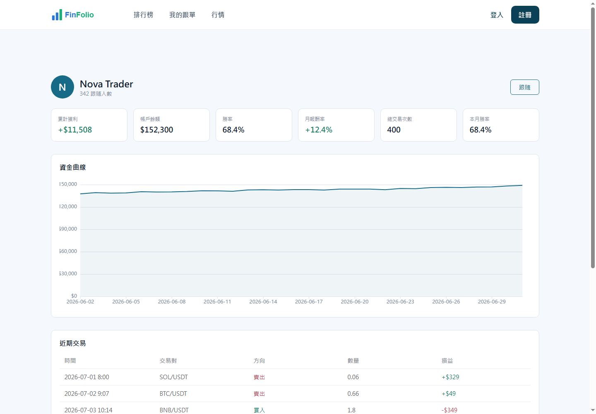
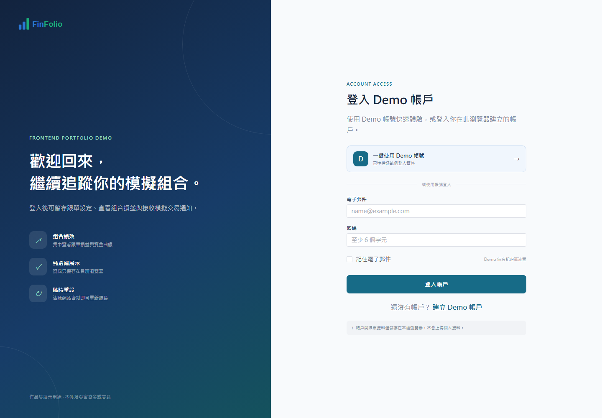
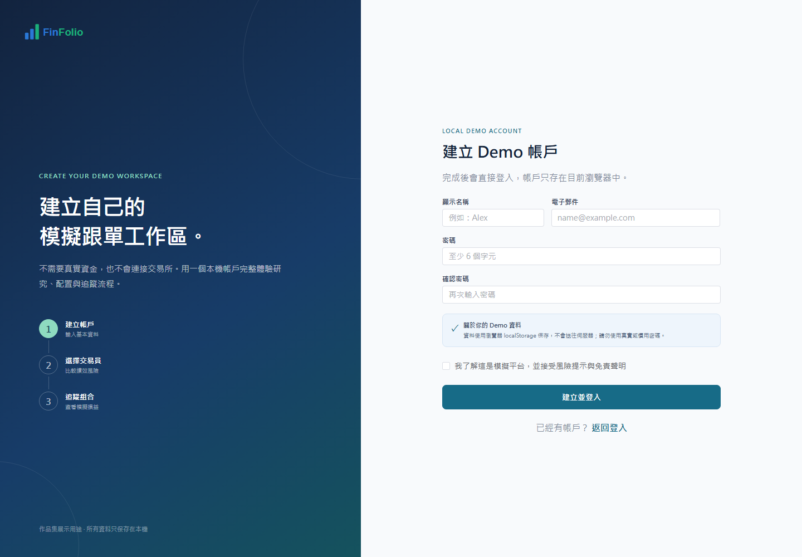
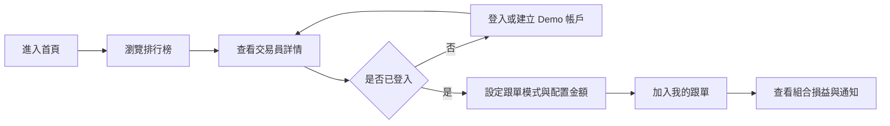
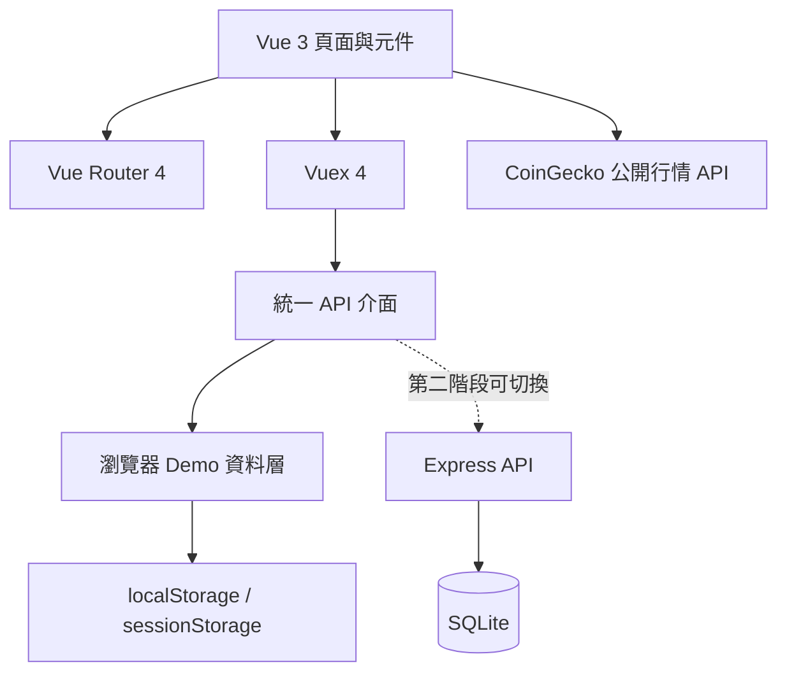

# FinFolio｜加密資產跟單投資前端 Demo



FinFolio 是一個以 Vue 3 與 Vite 建置的跟單投資作品集專案。使用者可以比較模擬交易員的績效與風險、查看資金曲線、設定跟單條件，並透過完整的註冊與登入流程體驗個人投資組合管理。

目前版本以「可直接部署到 GitHub Pages 的純前端 Demo」為主要定位。所有帳戶、登入狀態與跟單設定都儲存在瀏覽器，不會連接真實交易帳戶，也不會建立真實訂單。

## 專案重點

- 完整的首頁、註冊、登入、登出與登入後導頁流程
- 交易員排行榜、搜尋、排序與風險篩選
- 交易員績效、資金曲線與近期交易紀錄
- 跟單模式、配置金額與模擬停損設定
- 個人跟單看板、組合損益與交易通知
- CoinGecko 公開行情與 K 線資料展示
- Hash Router 與相對資源路徑，支援 GitHub Pages 子目錄
- Element Plus 與 ECharts 按頁面載入，降低首頁負擔
- 全站統一使用臺灣繁體中文

## Demo 帳號

```text
電子郵件：demo@finfolio.app
密碼：demo123
```

也可以從註冊頁建立自己的 Demo 帳戶。帳戶只會保存在目前瀏覽器，適合作品展示與流程測試，請勿使用真實或慣用密碼。

## 畫面展示

### 交易員排行榜

依月報酬率、勝率、跟隨人數及帳戶餘額排序，並支援名稱搜尋與風險等級篩選。



### 交易員詳情

集中呈現交易員的累計獲利、帳戶餘額、勝率、資金曲線及近期交易紀錄。



### 登入流程

可使用預設 Demo 帳號一鍵登入，也可以登入目前瀏覽器中自行建立的帳戶。



### 註冊流程

註冊完成後會直接登入。畫面明確說明資料僅儲存在瀏覽器，不會上傳至伺服器。



## 使用者流程



## 前端架構



目前 GitHub Pages 版本使用瀏覽器 Demo 資料層。`server/` 保留 Express、SQLite 與 JWT 實作，作為後續整合真正後端服務的基礎。

## 技術架構

| 類別 | 技術 |
|---|---|
| 前端框架 | Vue 3.5、Options API |
| 開發與建置 | Vite 7 |
| 路由 | Vue Router 4、Hash Router |
| 狀態管理 | Vuex 4 |
| UI 元件 | Element Plus，按需載入 |
| 圖表 | ECharts 5，僅載入折線圖與 K 線圖模組 |
| 多語系 | Vue I18n 11、`zh-TW` |
| Demo 儲存 | localStorage、sessionStorage |
| 選用後端 | Express、SQLite、JWT |
| 自動部署 | GitHub Actions、GitHub Pages |

## 資料與狀態設計

- 交易員資料使用可重現的模擬資料，確保每次展示結果一致。
- Demo 帳戶與跟單設定儲存在 `localStorage`。
- 登入階段資訊儲存在 `sessionStorage`，關閉分頁工作階段後失效。
- 市場頁會向 CoinGecko 取得公開行情；請求失敗時顯示錯誤或最近一次資料狀態。
- Demo 與後端共用同一組 API 介面，未來切換資料來源時不需要重寫頁面元件。

## 專案結構

```text
src/
├─ components/
│  ├─ common/          共用導覽列、頁尾與通知
│  ├─ login/           登入與註冊流程
│  ├─ leaderboard/     排行榜、交易員卡片與詳情
│  ├─ following/       個人跟單看板
│  └─ market/          即時行情與 K 線頁面
├─ data/               可重現的模擬交易員資料
├─ i18n/               臺灣繁體中文文案
├─ router/             前端路由與頁面分包
├─ store/              登入及跟單狀態
└─ utils/              Demo API、行情與圖表工具
```

## 本機執行

需要 Node.js 20.19 以上版本。

```bash
npm ci
npm run dev
```

開啟 <http://127.0.0.1:8081/>。

正式建置與本機預覽：

```bash
npm run build
npm run preview
```

靜態網站會輸出到 `dist/`。

## GitHub Pages 部署

專案已包含 [GitHub Pages workflow](.github/workflows/deploy-pages.yml)。Push 到 `main` 或 `master` 後會自動：

1. 安裝鎖定版本的前端套件
2. 執行 Vite 正式建置
3. 上傳 `dist/` 靜態網站
4. 部署至 GitHub Pages

首次部署時，請在 GitHub Repository 的 **Settings → Pages → Build and deployment**，將 Source 設為 **GitHub Actions**。

## 作品聲明

本專案僅供前端架構、UI 與操作流程展示，不構成投資建議。所有交易員、績效、交易紀錄與跟單損益皆為模擬資料。
