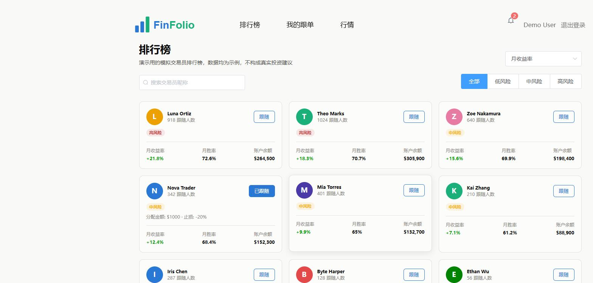
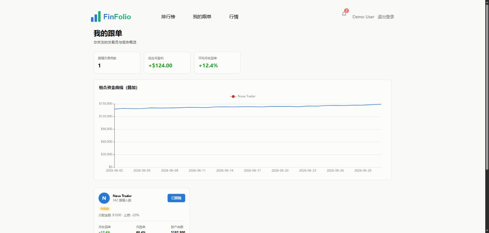
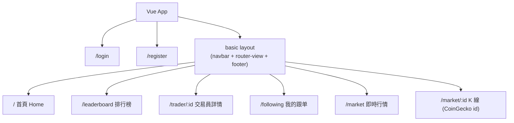
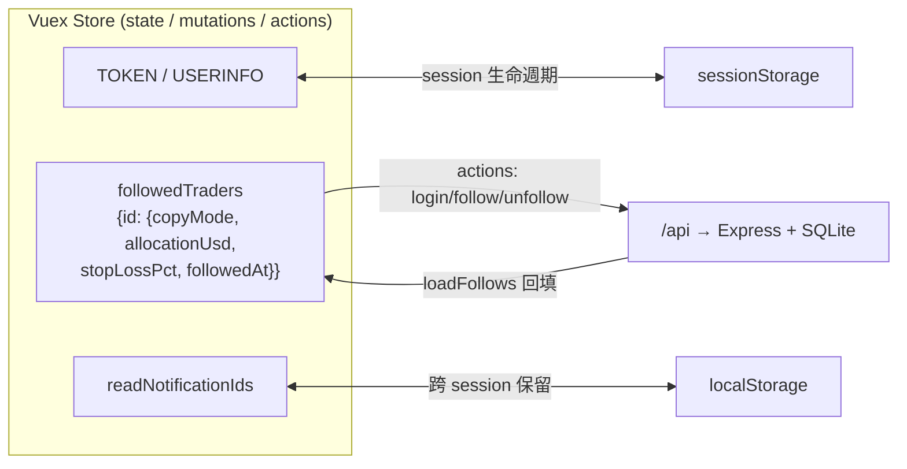
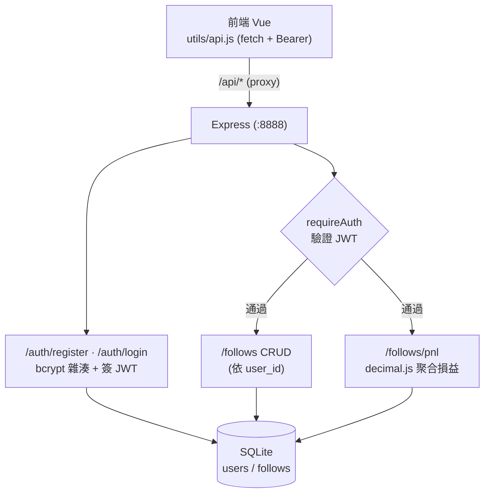
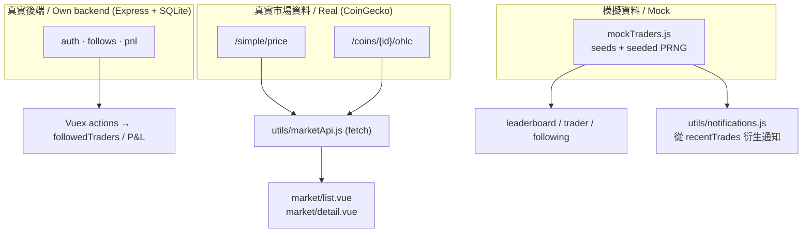

# FinFolio — 加密貨幣跟單交易平台 <br/><sub>A Crypto Copy-Trading Leaderboard Platform</sub>

[](https://github.com/seanhong1215/FinFolio/actions/workflows/ci.yml)

> 交易員排行榜、含損益(P&L)圖表的交易員詳情、跟單設定、我的跟單儀表板、即時行情與 K 線、通知中心。
> A copy-trading portfolio site: trader leaderboard, P&L charts, follow/copy settings, a "my copies" dashboard, live market quotes with candlestick charts, and a notification center.

<p>
  
  
  
  
  
  
  
  
  
</p>

---

## 目錄 / Table of Contents

- [專案定位 / Overview](#專案定位--overview)
- [線上 Demo 與截圖 / Demo & Screenshots](#線上-demo-與截圖--demo--screenshots)
- [功能亮點 / Features](#功能亮點--features)
- [技術棧 / Tech Stack](#技術棧--tech-stack)
- [系統架構 / Architecture](#系統架構--architecture)
- [技術決策與取捨 / Engineering Notes](#技術決策與取捨--engineering-notes)
- [關於這是 legacy 專案 / On Legacy Maintenance](#關於這是-legacy-專案--on-legacy-maintenance)
- [本機開發 / Getting Started](#本機開發--getting-started)
- [Roadmap（產品化方向）](#roadmap產品化方向)

---

## 專案定位 / Overview

**FinFolio** 模擬一個加密貨幣交易所的「跟單」(copy-trading)產品:使用者瀏覽交易員排行榜、檢視個別交易員的績效與資金曲線、設定跟單參數(跟單模式 / 分配金額 / 止損比例),並在「我的跟单」儀表板追蹤跟隨中的交易員。市場行情頁串接 **CoinGecko** 公開 API 取得**真實**加密貨幣價格與 K 線。

**FinFolio** simulates a crypto exchange copy-trading product. Users browse a trader leaderboard, inspect each trader's performance and equity curve, configure copy settings (copy mode / allocation / stop-loss), and track followed traders on a dashboard. The market page consumes **real** crypto prices and OHLC candlestick data from the public **CoinGecko** API.

> **資料真實性聲明 / Data disclosure:**
> - **真實後端**:使用者**認證(bcrypt + JWT)**、**跟單設定持久化**(SQLite)、**聚合損益(Decimal)** 皆由 `server/` 的 Express API 提供。
> - **真實市場資料**:`/market` 與 `/market/:id` 串接 CoinGecko。
> - **模擬資料**:交易員本身的績效/資金曲線/交易紀錄仍為 `mockTraders.js`(seeded)。
>
> Real backend now powers **auth (bcrypt + JWT)**, **follow-settings persistence (SQLite)**, and **Decimal P&L**. Market pages use real CoinGecko data. Trader profiles themselves remain seeded mock data.

---

## 線上 Demo 與截圖 / Demo & Screenshots

| 頁面 / Page | 連結 / Link |
|---|---|
| 🔗 線上 Demo / Live Demo | _待補 / TODO_ |

**交易員排行榜 / Leaderboard** — 已登入(navbar 顯示真實使用者),Nova Trader 已跟隨並顯示「分配金額 $1000」。
_Logged in; Nova Trader followed with a $1000 allocation._



**我的跟單儀表板 / My-copies dashboard** — 組合月盈利 **+$124.00** 由後端以 decimal.js 依 `$1000 × 12.4%` 精確計算(非前端浮點加總)。
_Aggregate P&L (+$124.00) is computed server-side with decimal.js from the user's allocation._



---

## 功能亮點 / Features

- **交易員排行榜 / Leaderboard** — 10 位交易員的績效卡片列表,可依報酬率排序、檢視風險等級。
- **交易員詳情 + P&L 圖表 / Trader detail** — ECharts 繪製的資金曲線與近期交易紀錄。
- **跟單設定流程 / Copy settings** — 點「跟隨」先跳出設定彈窗(跟單模式 / 分配金額 USD / 止損比例),確認後才建立跟單。
- **我的跟单儀表板 / My-copies dashboard** — 彙整目前跟隨中的交易員,重複使用同一份卡片元件。
- **即時行情 + K 線 / Live market** — CoinGecko 即時價格(45 秒輪詢 + 手動刷新)與 candlestick K 線圖。
- **通知中心 / Notifications** — 從「跟隨中交易員的最近交易」動態衍生通知,含已讀狀態。
- **登入 / 註冊 / Real auth** — 真實後端註冊/登入,密碼以 **bcrypt** 雜湊儲存、發 **JWT**;登入攔截發生在「動作當下」而非路由層。
- **跟單持久化 + Decimal P&L** — 跟單設定存入 **SQLite**,每位使用者獨立;聚合損益依各筆 `allocationUsd` 由後端以 **decimal.js** 精確計算。

---

## 技術棧 / Tech Stack

**前端 / Frontend**

| 分類 | 技術 |
|---|---|
| 前端框架 | Vue 2.5(Options API) |
| 狀態管理 | Vuex 3(state / mutations / **actions**,actions 呼叫後端 API) |
| 路由 | Vue Router 3 |
| UI 元件庫 | Element UI 2.4 |
| 圖表 | ECharts(資金曲線 + candlestick K 線) |
| 打包 | 舊版 vue-cli webpack 樣板(webpack 3) |
| 即時資料 | CoinGecko 公開 API(原生 `fetch`,無 axios) |

**後端 / Backend(`server/`)**

| 分類 | 技術 |
|---|---|
| 伺服器 | Node.js + Express 4 |
| 資料庫 | SQLite(better-sqlite3);金額以 TEXT 存精確小數 |
| 認證 | bcryptjs(密碼雜湊)+ jsonwebtoken(JWT)+ 認證中介層 |
| 金額運算 | decimal.js(聚合 P&L) |
| 測試 | Node 內建 test runner(`node --test`) |
| 前後端串接 | webpack devServer proxy `/api` → `localhost:8888` |

---

## 系統架構 / Architecture

### 1. 路由與 Layout 結構 / Routing & Layout

`login` / `register` 是無殼頂層路由;其餘頁面共用 `basic` layout(navbar + footer)。**沒有路由層級的登入守衛** — `router.beforeEach` 只處理進度條與標題。



### 2. 狀態管理與持久化 / State & Persistence

登入態(JWT)隨分頁 session 走(登出即清);**跟單設定改由後端 SQLite 持久化**,前端 Vuex 透過 actions 呼叫 API 載入/更新;已讀通知仍留 localStorage。



### 3. 後端架構 / Backend Architecture(`server/`)

前端經 webpack devServer proxy(`/api` 去前綴)打到 Express;受保護端點需帶 JWT。



### 5. 資料流：真實 vs 模擬 / Data Flow: Real vs Mock

明確標示資料邊界 —— 認證/跟單/損益(自有後端)與市場行情(CoinGecko)為真實,交易員績效為 seeded mock。



---

## 技術決策與取捨 / Engineering Notes

這些是開發過程中實際踩過、並記錄在 `CLAUDE.md` 的問題與對應解法 —— 也是這個專案值得聊的工程細節:

- **CSS 顏色 token 化 + ECharts 的例外**
  全站顏色以 CSS 自訂屬性(`--brand-primary`、`--color-good`/`--color-critical`、`--chart-1..8`)定義,元件一律用 `var()`,不寫死色碼。**唯一例外是 ECharts** —— canvas 無法讀 `var()`,因此圖表顏色改在渲染當下透過 `utils/chartTheme.js` 的 `cssVar()`(內部 `getComputedStyle`)解析成實際色值再套用。

- **可重現的模擬資料(seeded PRNG)**
  10 位交易員的資金曲線與交易紀錄,來自小型 `seeds` 陣列 + 帶種子的線性同餘亂數產生器(`seededRandom`),因此每次重整頁面資料一致、可重現。`riskLevel` 由 `monthReturnRatePct` 換算(`riskLevelFromReturn()`),非手填。

- **OHLC 欄位順序轉換(易錯點)**
  CoinGecko `/ohlc` 回傳 `[時間, 開, 高, 低, 收]`,但 ECharts candlestick 需要 `[開, 收, 低, 高]` —— `market/detail.vue` 的 `renderChart()` 有做重新排列,是圖表正確性的關鍵。

- **動作層登入攔截,而非路由守衛**
  需要登入的操作(如跟單)在「動作發生的當下」透過 `utils/requireLogin.js` 檢查 `TOKEN`,而不是在路由層攔截。好處是未登入者仍可瀏覽,只在真正需要時才導向登入。

- **背景刷新的錯誤韌性**
  市場頁 45 秒輪詢,**背景刷新失敗時保留舊資料**只加提示,不整頁清空 —— 即時資料介面該有的降級行為。

- **跟單設定的響應式陷阱**
  `followedTraders` 是以交易員 id 為動態 key 的物件,新增/刪除必須用 `Vue.set` / `Vue.delete` 才能觸發 Vue 2 的響應式更新。

### 後端化的設計重點 / Backend engineering notes

- **密碼絕不明文** — 註冊時以 **bcrypt** 雜湊(自帶 salt)儲存;登入成功後簽發 **JWT**,後續請求只帶 Bearer token,不再傳密碼。受保護端點統一過 `requireAuth` 中介層。前端「記住帳號」只把 **email** 存進 localStorage(**絕不存密碼**),並在載入時清除舊版可能殘留的明文密碼 key,避免 XSS 竊取。
- **金額不用 float** — 資料庫的 `allocation_usd` 以 **TEXT 存精確小數字串**;聚合損益在 `server/src/pnl.js` 以 **decimal.js** 計算(`0.1 + 0.2` 這類浮點誤差在對帳場景不可接受),並有 `node --test` 單元測試覆蓋(含浮點誤差情境)。
- **P&L 為後端權威** — 交易員月報酬率是後端 seed(`TRADER_RETURNS`),使用者損益 = 各筆 `allocationUsd × 報酬率`,**不信任前端傳入的數字**。讓「配置金額」真正影響結果(舊版前端直接加總交易員自身獲利、忽略配置)。
- **零 CORS 設定** — 沿用專案原有的 webpack devServer proxy(`/api` → `:8888` 並去前綴),前後端分離但開發期免處理跨域。
- **避免循環相依** — `utils/api.js` 直接從 `sessionStorage` 讀 token,而非 import store,避免 `store ↔ api` 互相 import。

---

## 關於這是 legacy 專案 / On Legacy Maintenance

誠實說明:本專案建構在一套**既有的舊版 vue-cli webpack 3 樣板**上,核心函式庫(`Vue`、`Vuex`、`ECharts` 等)是透過 `index.html` 的 `<script>` 以**全域變數**載入,而非 npm import。這是接手既有專案的常見型態。

我的做法是把每一個踩過的坑(webpack/less-loader 不保證編譯巢狀 LESS、精簡版 ECharts 缺 candlestick 元件、WebGL 地球元件對祖先背景敏感等)**系統化記錄在 `CLAUDE.md`**,讓後續維護有跡可循。這正是金融機構大量 legacy 系統所需要的能力 —— **能安全接手、理解並漸進改善既有程式碼**,而不只是從零開新專案。

> This project is intentionally kept as a realistic *legacy* codebase (global-script library loading on an old webpack 3 template). The value on display here is disciplined maintenance: every pitfall is documented in `CLAUDE.md` so the system stays maintainable — the same skill banks need for their large legacy estates.

---

## 本機開發 / Getting Started

需要**同時啟動後端與前端**(前端經 proxy 打到後端 `:8888`)。

**1. 後端 / Backend**
```bash
cd server
npm install
cp .env.example .env    # 可選：設定 JWT_SECRET / PORT
npm start               # Express 監聽 http://localhost:8888
npm test                # Decimal P&L 單元測試（node --test）
```

**2. 前端 / Frontend**(另開一個終端機)
```bash
npm install
npm run dev             # webpack-dev-server，port 8081，/api 自動代理到 :8888
npm run build           # 打包正式版到 dist/
```

> 前端本身沒有 linter；只確認可否編譯:`npx webpack --config build/webpack.dev.conf.js`。
> 後端測試:`cd server && npm test`。

---

## Roadmap（產品化方向）

從「作品集示範」邁向「產品」的待辦,對應金融軟體的核心要求:

- [x] **真後端 + 持久化** — 跟單設定 / P&L 改為 Express API + SQLite。
- [x] **真實認證** — bcrypt 密碼雜湊 + JWT + 認證中介層。
- [x] **金額精度** — 聚合 P&L 以 decimal.js 計算、金額以 TEXT 精確儲存,避免浮點誤差。
- [x] **後端單元測試** — `node --test` 覆蓋 P&L 計算(含浮點誤差情境)。
- [ ] **CI/CD** — GitHub Actions:後端 test + 前端 build。
- [ ] **前端測試** — 導入前端單元測試(通知衍生、OHLC 轉換等純邏輯)。
- [ ] **即時推播** — 以 WebSocket / SSE 取代 45 秒輪詢。
- [ ] **技術棧現代化(評估)** — 視需求評估 Vue 3 / Vite 遷移路徑。

---

<sub>本專案為個人作品集用途 / For personal portfolio use.</sub>
